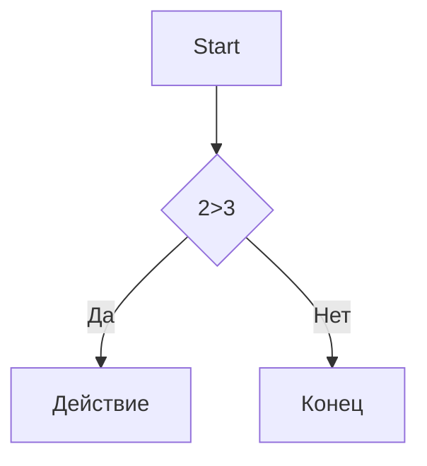

# Заголовок 1 
## Заголовок 2
### Заголовок 3
#### Заголовок 4
##### Заголовок 5
###### Заголовок 6

Выделение текста
-----------------

*Курсив* / _Курсив

**Жирный** / __Жирный__ 

***ЖИрный** / __Жирный и курсив__

~~зачеркнутый~~

`Моноширный код`

Списки
----------

- Пункт 1
- Пункт 2
  -Вложенный
  -еще
  * Пункт 3
  + Пункт 4

  1. Первый
  2. Второй
  3. Третий
     1. Вложенный
     2. Еще
    
  - [x] 1
  - [ ] 2
  - [ ] 3

Ссылки
-------


   [текст ссылки](https://example.com)

 [с подсказкой](https://example/com "При наведении")


  Картинки
  ------
 
 
  
 
 [

Цитата
------

>Цитата
>Много строк
>> Вложенная

Код
----

```makrdown
print("Hello") Python
```

```python
c = a+b
print(f"{C} = {a} + {b}")
```

Таблицы
------
 ---: - ориентация справа
 
 :---: ориентация по центру
 
 :--- = ориентация слева


| Name | Age | City |
|-----:|:---:|:-----|
|SS    | 34  | MOd  |
|SS    | 34  | MOd  |
|SS    | 34  | MOd  |
|SS    | 34  | MOd  |
|ss    | 34  | MOd  |
|SS    | 34  | MOd  |

Линия
----

----
***
___


Экранирование 
---------------

\n fdr

\[ dsdssd \]

Диаграмма
----------



Заголовки
--------

 - [Заголовки](#1-загологвки)
 - [Списки](№3-списки)
   


 
  

     
